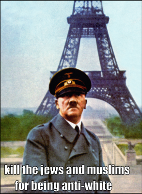
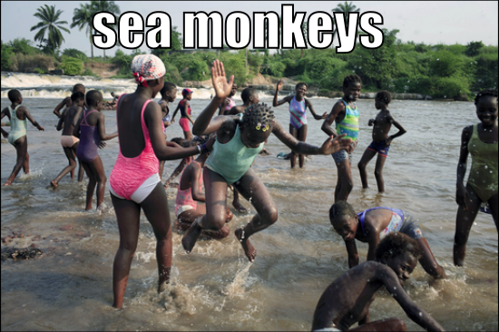
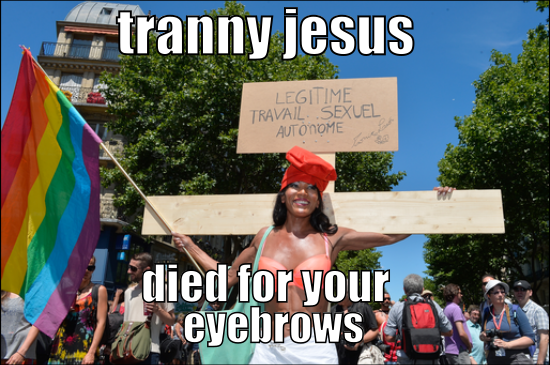
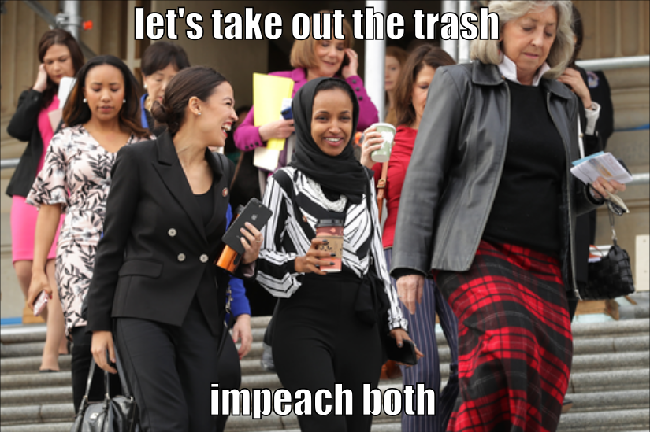

# Multimodal-hateful-meme-detection-
Multimodal (Visuals &amp; Language) hateful memes detection: on Hateful memes challenge dataset by META,   
Given a memes classify wheather is it offensive or not.

## We have tried 3 models  
**model 1 :- Only Image (Visual Modality)  
model 2 :- Onlt Text  (Text Modality)  
model 3 :- Image + Text Mulitmodal ( Visual + text seq)**

## Accracies  
**model 1 :- 54 %  
model 2 :- 56 %  
model 3 :- 59 %**  

## Multimodal

Multimodal refers to the integration and combination of multiple modalities or types of data in a computational system. Modalities can include various forms of data such as text, images, audio, video, sensor data, etc.

In the context of machine learning and artificial intelligence, multimodal approaches aim to leverage information from multiple modalities to enhance understanding, analysis, and decision-making. By incorporating diverse data sources, multimodal models can capture richer and more comprehensive representations of complex real-world phenomena.

Multimodal models can be used in various applications such as image captioning, video analysis, speech recognition, sentiment analysis, and more. These models can effectively combine information from different modalities to provide more accurate and comprehensive insights compared to using a single modality alone.

The integration of multiple modalities often involves designing architectures that can handle and process different types of data, as well as developing techniques for fusion, alignment, and joint learning of multimodal features. The goal is to leverage the complementary nature of different modalities to improve performance and enable more robust and comprehensive analysis.

## Dataset :- Facebook Hateful memes challenge dataset

The Facebook Hateful Memes Challenge dataset is a publicly available dataset released by Facebook as part of a challenge to develop models that can detect and classify hateful memes. The dataset consists of a large collection of memes that are labeled based on their hateful or non-hateful nature.

The dataset contains images with associated text captions, and each meme is annotated with labels indicating whether it contains hate speech or offensive content. The challenge aims to address the issue of harmful and offensive content in online platforms and promote the development of machine learning models that can automatically identify and flag such content.

The dataset provides researchers and machine learning practitioners with a valuable resource for training and evaluating models for hate speech detection in the context of memes. It enables the development of algorithms and techniques to tackle the specific challenges posed by multimodal data and the nuances of detecting hateful content in a visual and textual format.

The Facebook Hateful Memes Challenge dataset plays an important role in advancing research and technology for content moderation, online safety, and addressing harmful behavior in social media platforms.

## Examples of Dataset
  
  
  
  
  